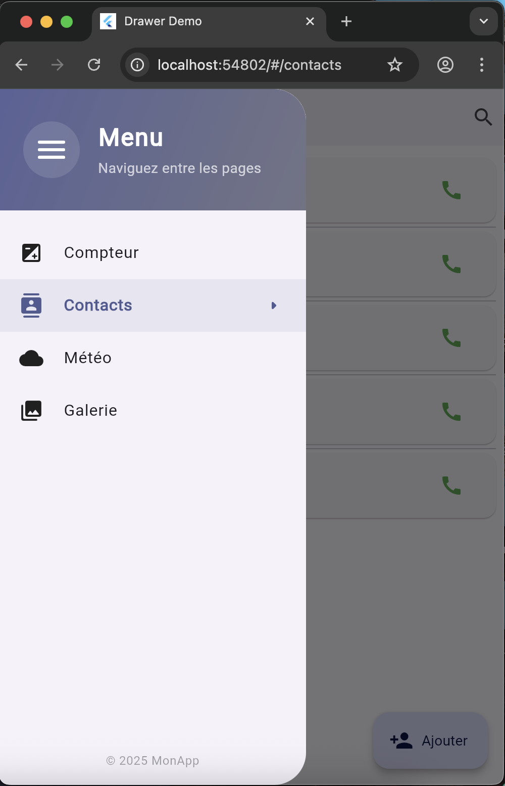
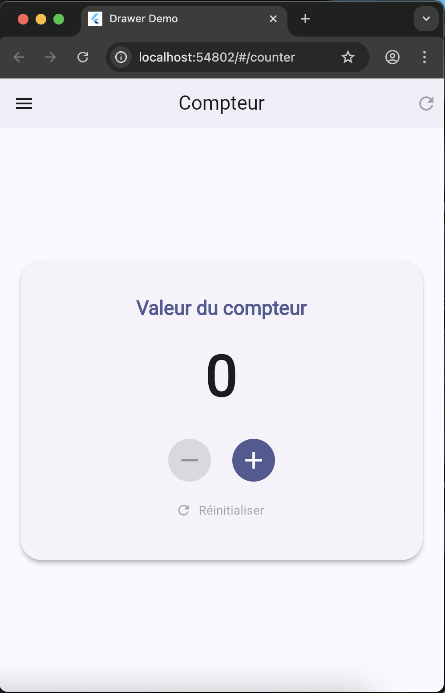
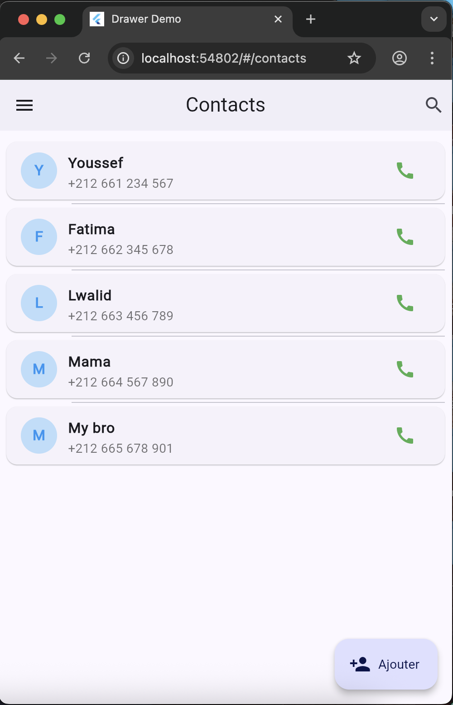
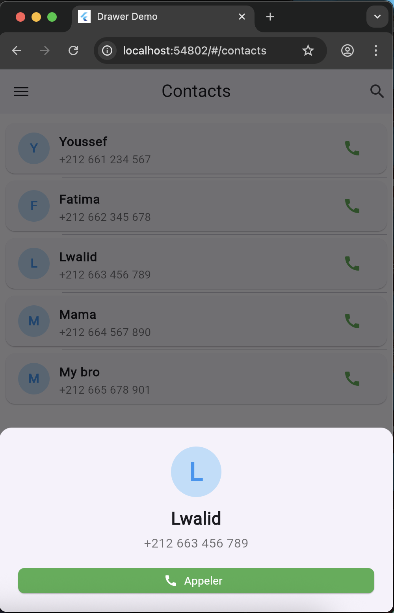
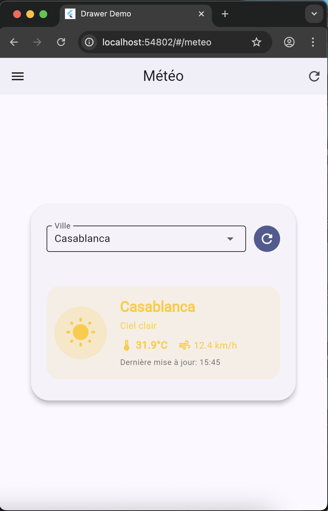
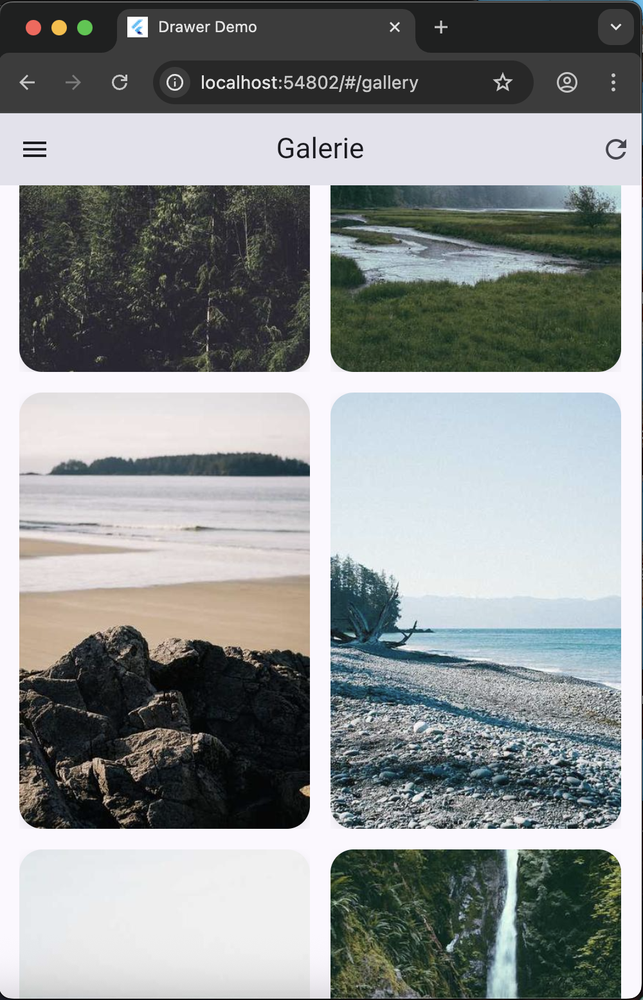

## Drawer Demo

A simple Flutter app showcasing a modern navigation drawer with four example pages: Counter, Contacts, Weather (Météo), and Gallery. Built with Material 3.

### Features

- **Navigation Drawer**: Polished drawer UI with active state, icons, and route navigation.
- **Counter**: Increment, decrement, and reset with smooth animations.
- **Contacts**: Mock contact list with call actions and a detail bottom sheet.
- **Weather (Météo)**: Current weather from Open‑Meteo for preset cities (no API key required). Loading and error states included.
- **Gallery**: Responsive grid of remote images with Hero transitions and fullscreen zoom (InteractiveViewer).
- **Theme**: Material 3 with `colorSchemeSeed` and system light/dark support.

### Screenshots

| Drawer | Counter | Counter (after) |
|---|---|---|
|  |  |  |

| Contacts | Contact (detail) | Weather | Gallery |
|---|---|---|---|
|  |  |  |  |


### Getting Started

#### Prerequisites
- Flutter SDK installed and set up

#### Setup
1. Install dependencies:
   ```bash
   flutter pub get
   ```
2. Run the app:
   ```bash
   flutter run
   ```

### Project Structure

- `lib/main.dart` – App entry point, theme, and route table
- `lib/widgets/drawer_menu.dart` – Drawer UI and navigation items
- `lib/pages/counter_page.dart` – Counter page
- `lib/pages/contacts_page.dart` – Contacts list and details
- `lib/pages/meteo_page.dart` – Weather page using Open‑Meteo
- `lib/pages/gallery_page.dart` – Image grid with fullscreen preview

### How it works

- Routing uses named routes (`/counter`, `/contacts`, `/meteo`, `/gallery`).
- The drawer highlights the active route and uses `Navigator.pushReplacementNamed` for page switches.
- Weather data is fetched from Open‑Meteo’s public API; no API key needed.

### Dependencies

- `flutter`
- `http` – network requests
- `cupertino_icons` – iOS icon set

### Notes

- Initial route is set to `'/counter'` in `lib/main.dart`. Change `initialRoute` to `'/'` and uncomment the Home page route if you want to start on Home.

